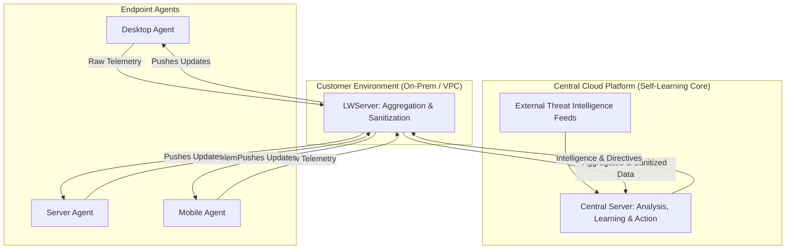

# Cyber Architect AI

A dynamic, enterprise-ready admin console that simulates an AI-powered, self-learning cybersecurity platform, complete with an expert AI assistant for real-time architectural design and guidance.

This project demonstrates a sophisticated "single pane of glass" UI for monitoring and managing a global fleet of security agents, visualizing the server's intelligence-gathering process, and interacting with a powerful AI architect.

## Core Features

### 1. Unified Enterprise Console
- **Professional "Single Pane of Glass" UI:** A modern, intuitive layout designed for security operations, providing a comprehensive overview of the entire security ecosystem.
- **Asset-Centric Navigation:** A master sidebar allows for seamless switching between three core views: a high-level **Dashboard**, a detailed **Agent Fleet** management interface, and the deep-dive **Server Intelligence** feed.
- **Persistent AI Assistant:** A collapsible chat panel provides constant access to the Cyber Architect AI for architectural questions, code generation, and deployment guidance without leaving the console.

### 2. Advanced Agent Fleet Management
- **Enterprise-Grade Asset Table:** A dedicated "Agent Fleet" view provides a powerful interface for managing a diverse fleet of simulated agents (Windows, Linux, macOS, Mobile, IoT, etc.).
- **Sort, Filter & Search:** The agent list features sortable columns for key attributes (Status, OS, IP, Version, etc.) and allows for dynamic filtering by OS and searching by hostname/IP.
- **Interactive Drill-Down:** A master-detail layout allows you to select any agent from the master table to instantly view its specific security posture, configuration, and a real-time feed of its raw alerts.

### 3. Real-Time Intelligence & Analytics
- **Intelligence Dashboard:** The main dashboard provides a high-level overview with:
    - **Server & Agent Knowledge Meters:** Visualize the intelligence level of the server and the agent fleet.
    - **Threat Heatmaps:** At-a-glance charts showing the most impacted industries and geographical regions (Continents, Regions, Countries).
    - **Correlation Activity Graph:** A real-time "heartbeat" graph showing the server's analytical workload.
- **Server Intelligence Feed:** A live feed of the server's "brain," showing aggregated events, learning from external sources, and proactive security actions.
- **Click-to-Explore:** Click on any event in any feed to open a focused, full-detail view of its underlying logs and payload data.

### 4. Simulated Self-Learning Engine
- **Bidirectional Communication:** The UI visualizes the complete, end-to-end security loop: agents send raw telemetry, the server learns, and the server pushes actionable intelligence (rules, models, directives) back to the agents.
- **Multi-Source Intelligence Fusion:** The simulation demonstrates the server learning from a wide array of external sources, including **MITRE ATT&CK, NVD, EPSS, Exploit-DB, VirusTotal,** and other security vendors.
- **Context-Aware AI:** The server learns from the geographical and industry context of threats to issue targeted, proactive alerts to agents in high-risk trajectories.
- **Automated Security Actions:** The simulation visualizes the server taking automated actions for the most critical threats, such as triggering a host remediation or enforcing a Zero Trust policy.

### 5. Operational & Deployment Tooling
- **Agent Deployment Modal:** A user-friendly modal to generate copy-paste-ready deployment scripts for multiple platforms, including Windows, Linux, macOS, and mobile.
- **Multi-Cloud Infrastructure Guides:** The deployment modal includes detailed, step-by-step instructions for provisioning and configuring the `LWServer` on both **AWS (EC2)** and **Azure (VM)**.
- **Agent Configuration:** A settings modal allows administrators to control agent behavior, such as scan frequency, log verbosity, and detection sensitivity.
- **Transparency & Versioning:**
    - The UI displays a version number that opens a **"What's New"** modal with detailed release notes.
    - A **"Learning Analytics"** modal provides a data-driven, verifiable "proof of learning," showing exactly how each event contributes to the server's knowledge growth.

## Architectural Overview

The application simulates a modern, three-tiered security architecture. This design ensures scalability, data privacy, and operational resilience.

-   **Endpoint Agents:** Lightweight clients deployed on a diverse range of devices that collect raw security telemetry.
-   **LWServer (Simulated):** An intermediate server that aggregates telemetry, sanitizes sensitive data, and acts as a local cache for intelligence updates from the central server.
-   **Central Cloud Platform (Simulated):** The "brain" of the operation. It ingests data from all LWServers, fuses it with external threat intelligence, runs ML models, and orchestrates the defense across the entire agent fleet.

## Technology Stack

-   **Frontend:** React, TypeScript
-   **Styling:** Tailwind CSS
-   **AI Integration:** Google Gemini API
-   **Diagramming:** Mermaid.js
